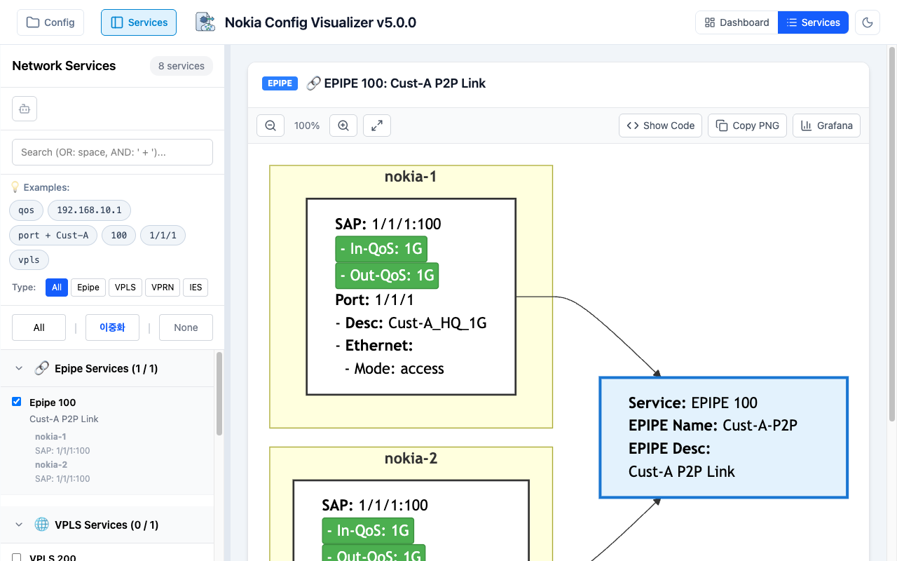
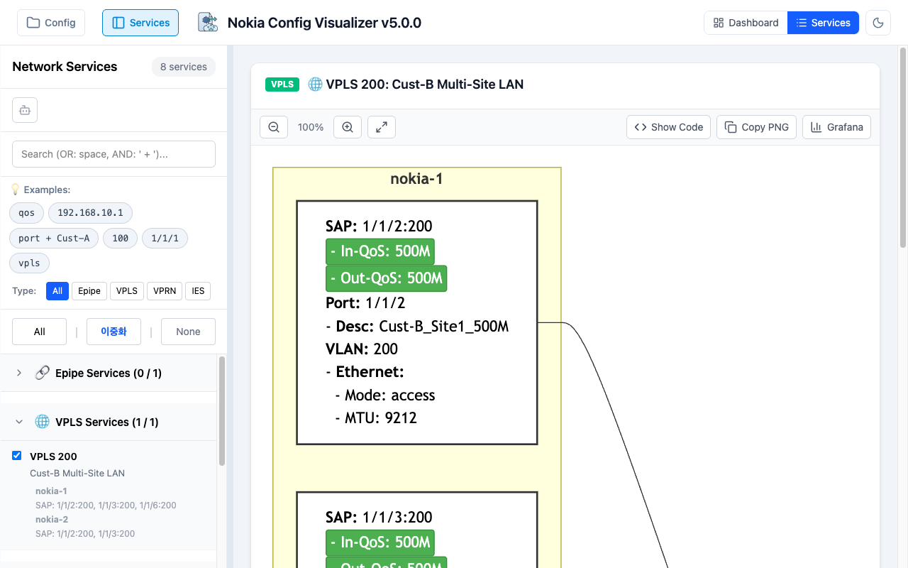
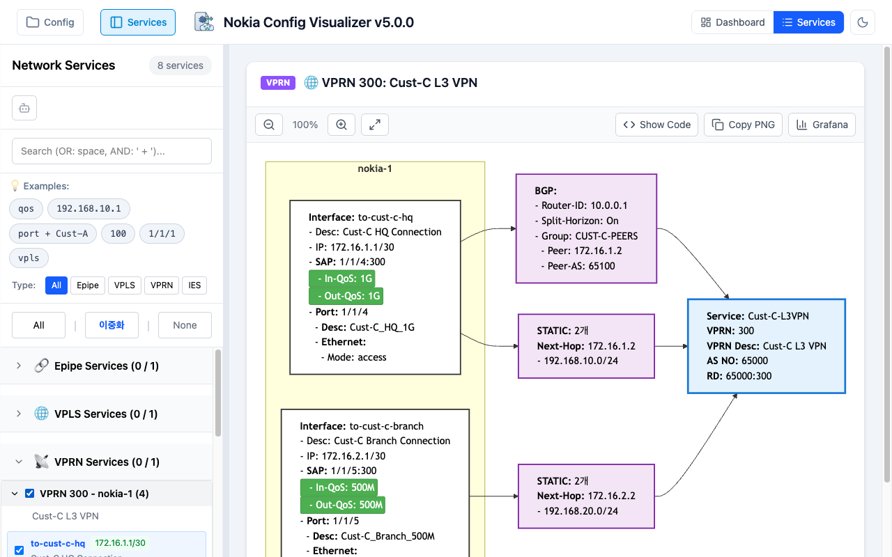
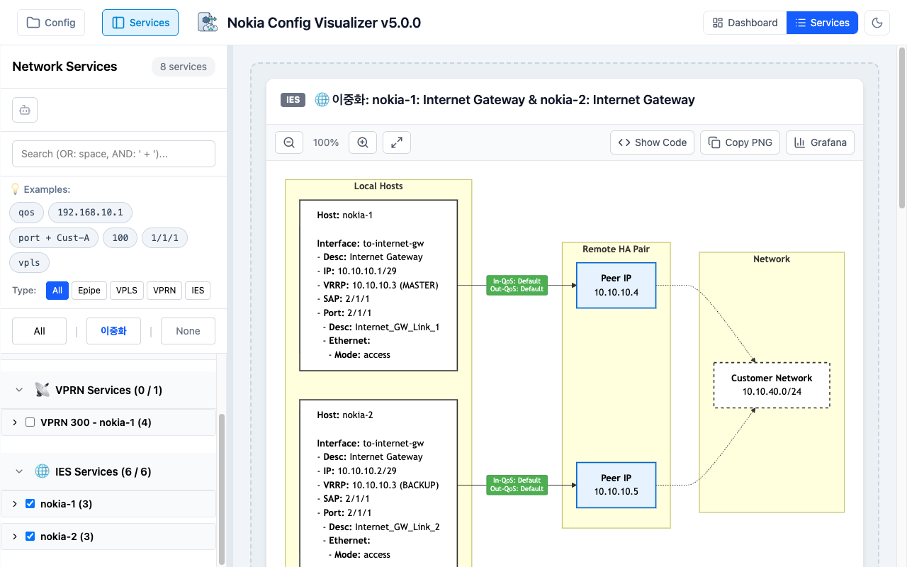
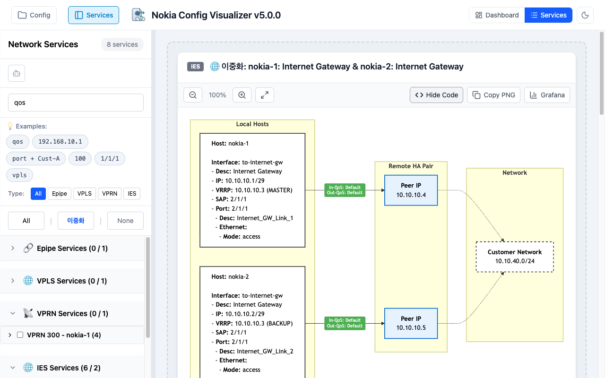
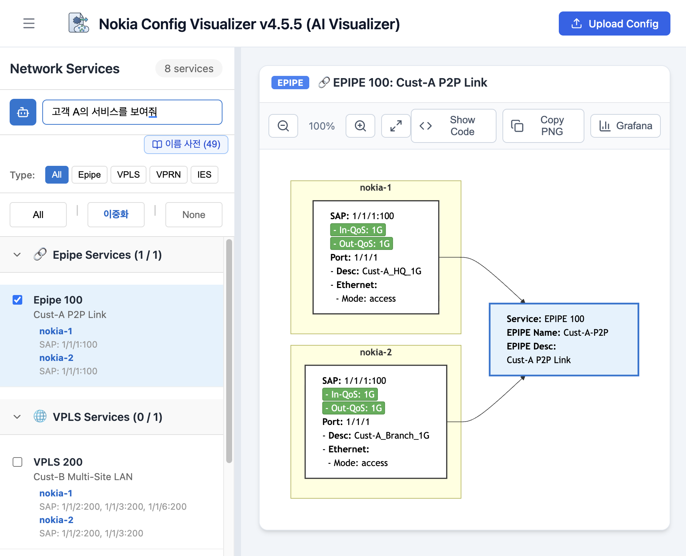
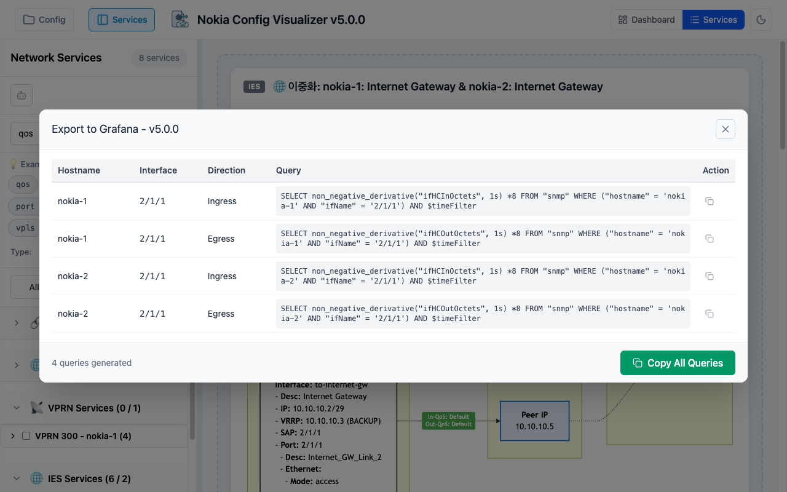

# Nokia Config Visualizer

> 🚀 **v4.5.5** (Latest) - Nokia 네트워크 장비 / Unified Network & Service Visualizer + AI 챗봇 + 이름 사전 + Grafana 쿼리 생성


[](https://github.com/20eung/nokia-config-visualizer/releases)
[](https://opensource.org/licenses/MIT)

## 📖 프로젝트 개요

네트워크 엔지니어가 복잡한 Nokia 장비 설정 파일을 쉽게 이해하고 분석할 수 있도록 돕는 웹 기반 시각화 도구입니다. 텍스트 형태의 설정을 파싱하여 인터페이스, 포트, 연동 장비 정보를 추출하고, **Mermaid.js**를 이용해 직관적인 다이어그램으로 변환합니다. 생성된 다이어그램은 **Grafana Diagram 패널**과 완벽하게 호환되어 실시간 모니터링 환경에 통합할 수 있습니다.

## ✨ 주요 기능

### 🔍 지능형 파싱
- **호스트네임 및 시스템 정보** 추출
- **인터페이스 및 포트** 상세 분석
- **IP 주소, 서브넷** 파싱
- **QoS 정책** (Ingress/Egress) 추출
- **서비스 정보** (VPRN/IES/VPLS) 파싱
- **정적 라우팅** (Static Route) 경로 및 Next-Hop 분석
- **VRRP 설정** (VIP, Priority) 파싱

### 🎨 다이어그램 시각화
- **Single Interface Diagram**: 개별 인터페이스별 독립적인 토폴로지
- **HA Diagram**: 이중화 구성 자동 감지 및 통합 다이어그램
  - 동적 HA 감지 (Static Route + VRRP 기반)
  - VRRP Master/Backup 표시
  - VIP (Virtual IP) 표시
- **QoS 정보** 링크 라벨에 표시
- **확대/축소** 및 **PNG 클립보드 복사** 지원 (다운로드 워크플로우 제거, 즉시 복사-붙여넣기)
- **Mermaid 코드 보기** 및 복사 기능
- **Grafana 호환성**: Grafana Diagram 패널과 완벽하게 호환되는 Mermaid 코드 생성

### 🌐 VPN 서비스 시각화 (v2.x)
- **Epipe (P2P)**: 양방향 QoS 정보, Source/Target 통합 다이어그램
- **VPLS (Multipoint)**: 멀티 장비 통합, Hub-and-Spoke 구조 시각화
- **VPRN (L3 VPN)**:
  - 인터페이스 및 Static Route 상세 정보
  - BGP Neighbor 및 Peering 정보
  - VRF, RD, AS 정보 표시
- **서비스 그룹화**: Service ID 및 Type 기반 자동 그룹화
- **통합 레이아웃**: Host(Left) - Service(Right) 표준화된 구조

**Epipe 다이어그램 예시:**



**VPLS 다이어그램 예시:**



**VPRN 다이어그램 예시:**



### 🌍 통합 비주얼라이저 (v3.x)
- **Base Router / IES 통합**: Global Routing Table 인터페이스 및 Static Route 시각화
- **VPRN 라우팅 노드**: BGP / OSPF / STATIC 분리 노드로 라우팅 관계 시각화
- **QoS 색상 강조**: 녹색 배경 + 흰색 글자로 QoS 시인성 향상 (모든 서비스 타입 통일)
- **QoS Rate KMG 변환**: 정책 기반 Rate 파싱 (100M, 500M, 1G, Max 표시)
- **Shutdown 필터링**: adminState='down' 항목 자동 제외
- **Host 기반 그룹핑**: IES 서비스를 장비별 그룹화, HA 다이어그램 자동 생성
- **v1/v2 통합**: 물리 토폴로지와 논리 서비스를 단일 플랫폼에서 지원

**IES 다이어그램 예시:**



**Mermaid 코드 보기:**


### 🤖 AI 챗봇 검색 (v4.0)
- **자연어 질문**: "Epipe 서비스 보여줘", "고객사A 관련 서비스", "QoS 1G 이상 서비스 찾아줘" 등
- **AWS Bedrock (Claude)**: 파싱된 설정 데이터를 AI가 분석하여 관련 서비스 자동 선택
- **AI 토글**: AI 검색과 기존 텍스트 검색을 자유롭게 전환
- **응답 패널**: 검색 결과 설명, 정확도 배지, 선택된 서비스 수 표시
- **기존 다이어그램 100% 호환**: AI가 selectionKey를 반환하면 기존 다이어그램 로직 자동 연동

**AI 챗봇 검색 예시:**



### 📊 Grafana 쿼리 자동 생성 (v4.5.2)
- **InfluxDB InfluxQL 쿼리 생성**: 선택한 서비스의 모든 포트에 대해 트래픽 모니터링 쿼리 자동 생성
- **모든 서비스 타입 지원**: Epipe, VPLS, VPRN, IES
- **HA 구성 지원**: 각 장비별 개별 hostname으로 쿼리 생성 (장비1, 장비2 개별 쿼리)
- **다이어그램 기반 필터링**: IES의 경우 선택된 다이어그램의 포트만 쿼리 생성
- **VPLS 연결 해석**: VPLS를 통해 연결된 IES 인터페이스의 실제 물리 포트 자동 탐지
- **서비스 포트 우선**: L2 Interlink(VLAN 있음) 대신 서비스 포트(VLAN 없음) 선택
- **개별/전체 복사**: 각 쿼리 개별 복사 + 전체 쿼리 한 번에 복사
- **쿼리 형식**: `SELECT non_negative_derivative("ifHCOutOctets", 1s) *8 FROM "snmp" WHERE ("hostname" = 'hostname' AND "ifName" = 'port') AND $timeFilter`

**Grafana 쿼리 생성 예시:**



### 📖 이름 사전 (v4.4.0 - 3-Field Structure)
- **3개 필드 구조**: 역할별 명확한 분리
  - **그룹명** (name): 대표 이름 (예: "고객사A")
  - **Config 키워드** (configKeywords): Config description에 실제 존재하는 키워드들 (예: ["CompanyA", "EntA", "PartnerA", "SecA"])
  - **검색 별칭** (searchAliases): 사용자 검색어 (예: ["고객사A", "엔터프라이즈A", "보안업체A", "파트너A"])
- **양방향 검색**: AI 챗봇이 configKeywords와 searchAliases 모두 검색하여 정확도 향상
- **AI 자동 생성**: Config description에서 엔티티를 AI가 자동 추출 및 분류
- **수동 편집**: 사전 항목의 추가, 수정, 삭제 지원 (3컬럼 테이블 UI)
- **서버 저장**: 서버 파일 시스템에 저장하여 브라우저 간 공유 가능
- **테이블 정렬**: 3개 컬럼 모두 클릭으로 정렬 가능 (한국어 로케일 지원)

### 🔎 고급 검색 기능
- **AND 검색**: ` + ` (공백 포함)로 구분
- **OR 검색**: 띄어쓰기로 구분
- **검색 필드**: Hostname, Port, Port Description, Interface Name, Interface Description, IP Address, Service Description

### 📁 인터페이스 관리
- **계층 구조**: 장비별 접기/펼치기 (파일 탐색기 스타일)
- **스마트 필터**: 
  - **All**: 모든 인터페이스 선택
  - **이중화**: HA 인터페이스만 자동 선택
  - **None**: 선택 해제
- **자연스러운 정렬** (Natural Sorting)
- **인터페이스 개수** 표시

### 🎯 사용자 편의성
- **드래그 앤 드롭** 또는 텍스트 붙여넣기 지원
- **여러 Config 파일** 동시 로드 가능
- **데모 모드**: 미리 준비된 설정 파일로 즉시 테스트 (Beta 환경)
- **크기 조절 가능한 사이드바**
- **모던하고 깔끔한 UI** 디자인

## 🛠 기술 스택

- **Frontend**: [React](https://react.dev/) 19 + [TypeScript](https://www.typescriptlang.org/)
- **Backend**: [Express](https://expressjs.com/) + [AWS Bedrock](https://aws.amazon.com/bedrock/) (Claude AI)
- **Build Tool**: [Vite](https://vitejs.dev/)
- **Visualization**: [Mermaid.js](https://mermaid.js.org/)
- **Integration**: [Grafana](https://grafana.com/) Diagram Panel 호환
- **Styling**: Vanilla CSS
- **Icons**: [Lucide React](https://lucide.dev/)
- **Image Export**: [html-to-image](https://github.com/bubkoo/html-to-image)
- **Infra**: Docker Compose (nginx + Express 별도 컨테이너)

## 🚀 시작하기

### 🎮 데모 환경에서 바로 체험하기

기능을 빠르게 확인하고 싶다면 **demo 브랜치**를 이용하세요. 샘플 config 파일이 자동으로 로드되어 즉시 테스트할 수 있습니다.

```bash
# demo 브랜치 클론
git clone -b demo https://github.com/20eung/nokia-config-visualizer.git
cd nokia-config-visualizer

# Docker Compose로 실행
docker-compose up -d

# 브라우저에서 접속
# http://localhost:3301
```

demo 브랜치는 hostname에 "demo" 또는 "beta"가 포함된 환경에서 자동으로 샘플 config를 로드합니다.

### 개발 환경 설치

#### 사전 요구사항

- Node.js (v22 이상 권장)
- npm
- Docker & Docker Compose (AI 기능 사용 시)

#### 설치 및 실행

```bash
# 저장소 클론
git clone https://github.com/20eung/nokia-config-visualizer.git
cd nokia-config-visualizer

# 패키지 설치
npm install

# 개발 서버 실행 (프론트엔드만)
npm run dev
```

브라우저에서 `http://localhost:5173`으로 접속하여 확인합니다.

#### 프로덕션 빌드

```bash
npm run build
npm run preview
```

#### Docker Compose로 전체 환경 실행 (AI 기능 포함)

```bash
# AWS 자격 증명 설정 (AI 기능 사용 시)
# ~/.aws/credentials 파일에 AWS 자격 증명 추가

# Docker Compose 실행
docker-compose up -d

# 브라우저 접속
# http://localhost:3301
```

## 📝 사용 방법

### 1. Config 파일 업로드

상단 헤더의 **"Upload Config"** 버튼을 클릭하여 Nokia 설정 파일(`.cfg`, `.txt`, `.conf`)을 업로드합니다.

### 2. 인터페이스 선택

- 왼쪽 패널에서 장비를 클릭하여 접기/펼치기
- 원하는 인터페이스를 체크박스로 선택
- **스마트 필터** 사용:
  - **All**: 모든 인터페이스 선택
  - **이중화**: HA 구성 인터페이스만 선택
  - **None**: 선택 해제

### 3. 검색 활용

검색창에 키워드 입력:
- **OR 검색**: `nokia-1 172.16` (띄어쓰기)
- **AND 검색**: `nokia-1 + 172.16` (` + ` 사용)

### 4. 다이어그램 확인

- **Single Diagram**: 개별 인터페이스별 독립적인 다이어그램
- **HA Diagram**: 이중화 구성 통합 다이어그램
  - Master: IP 앞에 `*` 표시
  - VIP: `(VIP: x.x.x.x)` 표시

### 5. 다이어그램 내보내기

- **PNG/SVG 다운로드**: 다이어그램 우측 상단 Download 버튼
- **Mermaid 코드 복사**: `<>` 버튼 클릭 → 복사 버튼
- **Grafana 연동**: 복사한 Mermaid 코드를 Grafana Diagram 패널에 붙여넣기하여 실시간 모니터링 대시보드 구축
- **Grafana 쿼리 생성**: 🔺 "Grafana" 버튼 클릭 → InfluxDB 쿼리문 자동 생성
  - Hostname, Interface, Direction(Ingress/Egress), Query 테이블 표시
  - 개별 쿼리 복사 또는 "Copy All Queries"로 전체 복사
  - Grafana Graph 패널에 붙여넣기하여 트래픽 그래프 생성

### 6. AI 챗봇 사용하기 (v3.3+)

#### 사전 준비: AWS Bedrock 설정

1. **AWS 자격 증명 설정**:
   ```bash
   # ~/.aws/credentials 파일 생성 또는 편집
   mkdir -p ~/.aws
   cat > ~/.aws/credentials << EOF
   [default]
   aws_access_key_id = YOUR_ACCESS_KEY_ID
   aws_secret_access_key = YOUR_SECRET_ACCESS_KEY
   EOF
   ```

2. **필요한 IAM 권한**:
   ```json
   {
     "Version": "2012-10-17",
     "Statement": [
       {
         "Effect": "Allow",
         "Action": ["bedrock:InvokeModel"],
         "Resource": "arn:aws:bedrock:ap-northeast-2::foundation-model/apac.anthropic.claude-sonnet-4-*"
       }
     ]
   }
   ```

3. **환경변수 설정** (선택사항):
   ```bash
   # .env 파일 생성 (또는 .env.example 참고)
   cp .env.example .env
   # 필요시 AWS_REGION, AWS_PROFILE, BEDROCK_MODEL_ID 수정
   ```

4. **Docker Compose로 실행**:
   ```bash
   docker-compose up -d
   ```

5. **브라우저 접속**:
   - http://localhost:3301

#### AI 검색 사용법

1. **Config 파일 업로드** (위의 1번 참고)

2. **AI 모드 활성화**:
   - 좌측 사이드바 상단의 **🤖 Bot 아이콘** 클릭
   - AI 입력창이 나타남

3. **자연어로 질문**:
   - 예시:
     - "172.16으로 시작하는 VPRN 서비스 보여줘"
     - "nokia-1의 모든 서비스 찾아줘"
     - "BGP를 사용하는 서비스 검색"
     - "QoS가 1G 이상인 인터페이스"
     - "고객사A 관련 서비스"

4. **AI 응답 확인**:
   - **정확도 배지**: 높음/보통/낮음
   - **선택된 개수**: N개 선택
   - **설명**: AI가 찾은 서비스에 대한 설명

5. **다이어그램 자동 표시**:
   - AI가 선택한 서비스의 다이어그램이 자동으로 표시됨
   - 기존 수동 검색과 동일한 방식으로 확대/축소/내보내기 가능

6. **초기화**:
   - AI 응답 패널 우측 상단의 **X** 버튼 클릭
   - 또는 Bot 아이콘을 다시 클릭하여 수동 검색 모드로 전환

#### 문제 해결

**오류: "AWS 자격 증명을 확인해주세요"**
- `~/.aws/credentials` 파일이 존재하는지 확인
- AWS_ACCESS_KEY_ID, AWS_SECRET_ACCESS_KEY가 올바른지 확인
- Docker 실행 시 ~/.aws가 마운트되었는지 확인

**오류: "AWS Bedrock 접근 권한이 없습니다"**
- IAM 사용자/역할에 `bedrock:InvokeModel` 권한이 있는지 확인
- 리전이 올바른지 확인 (기본값: ap-northeast-2)

**오류: "요청이 너무 많습니다"**
- 1분당 30회 제한 (Rate Limit)
- 1분 후 다시 시도

**상세 문서**:
- `.env.example` 파일 참고
- `docs/02-design/features/ai-chat-search.design.md` 참고

## 📂 프로젝트 구조

```
nokia-config-visualizer/
├── public/                      # 정적 자산
│   ├── config1.txt              # 데모용 Config (nokia-1)
│   └── config2.txt              # 데모용 Config (nokia-2)
├── src/
│   ├── components/              # UI 컴포넌트
│   ├── components/v2/           # V2 전용 컴포넌트
│   ├── components/v3/           # V3 전용 컴포넌트 (AIChatPanel 포함)
│   ├── pages/                   # 페이지 (V1Page, V2Page, V3Page)
│   ├── services/                # API 클라이언트 (chatApi)
│   ├── utils/                   # 핵심 로직 (v1 파서, 다이어그램, HA 감지)
│   ├── utils/v2/                # V2 파서 및 다이어그램
│   ├── utils/v3/                # V3 파서 및 다이어그램
│   ├── types.ts                 # TypeScript 타입 정의
│   ├── App.tsx                  # 메인 애플리케이션 (라우팅)
│   └── main.tsx                 # 진입점
├── server/                      # Express 백엔드 (AI API)
│   ├── src/                     # 서버 소스 (routes, services, prompts)
│   ├── Dockerfile               # 백엔드 Docker 이미지
│   └── package.json             # 백엔드 의존성
├── docs/                        # 프로젝트 문서
├── CHANGELOG.md                 # 변경 이력
├── DIAGRAM_RULES.md             # 다이어그램 렌더링 규칙
├── docker-compose.yml           # 멀티 컨테이너 구성
└── package.json
```

---

**전체 변경 이력**: [CHANGELOG.md](./CHANGELOG.md)

Made with ❤️ by Network Engineers, for Network Engineers

