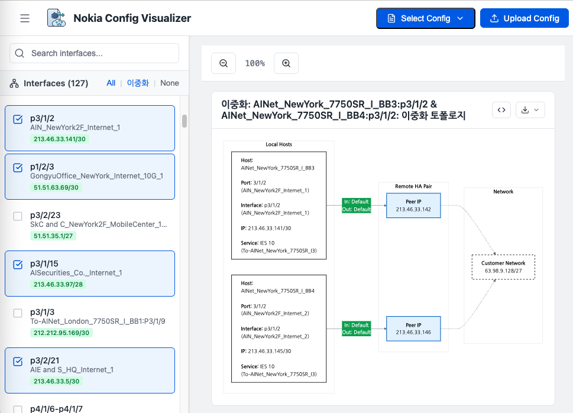

# Nokia Config Visualizer

> 🚀 **v3.1.0** (Latest) - Nokia 7750 SR / Unified Network & Service Visualizer



[](https://github.com/20eung/mermaid-web/releases)
[](https://opensource.org/licenses/MIT)

## 📖 프로젝트 개요

네트워크 엔지니어가 복잡한 Nokia 7750 SR 라우터 설정 파일을 쉽게 이해하고 분석할 수 있도록 돕는 웹 기반 시각화 도구입니다. 텍스트 형태의 설정을 파싱하여 인터페이스, 포트, 연동 장비 정보를 추출하고, **Mermaid.js**를 이용해 직관적인 다이어그램으로 변환합니다.

## ✨ 주요 기능

### 🔍 지능형 파싱
- **호스트네임 및 시스템 정보** 추출
- **인터페이스 및 포트** 상세 분석
- **IP 주소, 서브넷** 파싱
- **QoS 정책** (Ingress/Egress) 추출
- **서비스 정보** (VPRN/IES/VPLS) 파싱
- **정적 라우팅** (Static Route) 경로 및 Next-Hop 분석
- **VRRP 설정** (VIP, Priority) 파싱

### 🎨 다이어그램 시각화
- **Single Interface Diagram**: 개별 인터페이스별 독립적인 토폴로지
- **HA Diagram**: 이중화 구성 자동 감지 및 통합 다이어그램
  - 동적 HA 감지 (Static Route + VRRP 기반)
  - VRRP Master/Backup 표시
  - VIP (Virtual IP) 표시
- **QoS 정보** 링크 라벨에 표시
- **확대/축소** 및 **PNG/SVG 다운로드** 지원
- **Mermaid 코드 보기** 및 복사 기능
- **Mermaid 코드 보기** 및 복사 기능

### 🌐 VPN 서비스 시각화 (v2.x)
- **Epipe (P2P)**: 양방향 QoS 정보, Source/Target 통합 다이어그램
- **VPLS (Multipoint)**: 멀티 장비 통합, Hub-and-Spoke 구조 시각화
- **VPRN (L3 VPN)**:
  - 인터페이스 및 Static Route 상세 정보
  - BGP Neighbor 및 Peering 정보
  - VRF, RD, AS 정보 표시
- **서비스 그룹화**: Service ID 및 Type 기반 자동 그룹화
- **통합 레이아웃**: Host(Left) - Service(Right) 표준화된 구조

### 🌍 통합 비주얼라이저 (v3.x)
- **Base Router / IES 통합**:
  - Global Routing Table 인터페이스 및 Static Route 시각화
  - "IES 0" 가상 서비스를 통한 관리
- **Host 기반 그룹핑**: 
  - IES 서비스를 장비(Hostname) 별로 그룹화하여 표시
  - 다중 선택 시 고가용성(HA) 다이어그램 자동 생성
- **v1/v2 통합**: 물리 토폴로지와 논리 서비스를 단일 플랫폼에서 지원
### 🔎 고급 검색 기능
- **AND 검색**: ` + ` (공백 포함)로 구분
- **OR 검색**: 띄어쓰기로 구분
- **검색 필드**: Hostname, Port, Port Description, Interface Name, Interface Description, IP Address, Service Description

### 📁 인터페이스 관리
- **계층 구조**: 장비별 접기/펼치기 (파일 탐색기 스타일)
- **스마트 필터**: 
  - **All**: 모든 인터페이스 선택
  - **이중화**: HA 인터페이스만 자동 선택
  - **None**: 선택 해제
- **자연스러운 정렬** (Natural Sorting)
- **인터페이스 개수** 표시

### 🎯 사용자 편의성
- **드래그 앤 드롭** 또는 텍스트 붙여넣기 지원
- **여러 Config 파일** 동시 로드 가능
- **데모 모드**: 미리 준비된 설정 파일로 즉시 테스트 (Beta 환경)
- **크기 조절 가능한 사이드바**
- **모던하고 깔끔한 UI** 디자인

## 🛠 기술 스택

- **Frontend**: [React](https://react.dev/) 19 + [TypeScript](https://www.typescriptlang.org/)
- **Build Tool**: [Vite](https://vitejs.dev/)
- **Visualization**: [Mermaid.js](https://mermaid.js.org/)
- **Styling**: Vanilla CSS
- **Icons**: [Lucide React](https://lucide.dev/)
- **Image Export**: [html-to-image](https://github.com/bubkoo/html-to-image)

## 🚀 시작하기

### 사전 요구사항

- Node.js (v18 이상 권장)
- npm

### 설치 및 실행

```bash
# 저장소 클론
git clone https://github.com/20eung/mermaid-web.git
cd mermaid-web

# 패키지 설치
npm install

# 개발 서버 실행
npm run dev
```

브라우저에서 `http://localhost:5173`으로 접속하여 확인합니다. (기본 V2 UI)

### 프로덕션 빌드

```bash
npm run build
npm run preview
```

## 📝 사용 방법

### 1. Config 파일 업로드

상단 헤더의 **"Upload Config"** 버튼을 클릭하여 Nokia 설정 파일(`.cfg`, `.txt`, `.conf`)을 업로드합니다.

### 2. 인터페이스 선택

- 왼쪽 패널에서 장비를 클릭하여 접기/펼치기
- 원하는 인터페이스를 체크박스로 선택
- **스마트 필터** 사용:
  - **All**: 모든 인터페이스 선택
  - **이중화**: HA 구성 인터페이스만 선택
  - **None**: 선택 해제

### 3. 검색 활용

검색창에 키워드 입력:
- **OR 검색**: `BB3 210.211` (띄어쓰기)
- **AND 검색**: `BB3 + 210.211` (` + ` 사용)

### 4. 다이어그램 확인

- **Single Diagram**: 개별 인터페이스별 독립적인 다이어그램
- **HA Diagram**: 이중화 구성 통합 다이어그램
  - Master: IP 앞에 `*` 표시
  - VIP: `(VIP: x.x.x.x)` 표시

### 5. 다이어그램 내보내기

- **PNG/SVG 다운로드**: 다이어그램 우측 상단 Download 버튼
- **Mermaid 코드 복사**: `<>` 버튼 클릭 → 복사 버튼

## 📂 프로젝트 구조

```
mermaid-web/
├── docs/                    # 프로젝트 문서
├── public/
│   └── docs/                # 데모 config 파일
├── src/
│   ├── components/          # UI 컴포넌트
│   │   ├── ConfigSelector.tsx
│   │   ├── DiagramViewer.tsx
│   │   ├── FilePreviewModal.tsx
│   │   ├── FileUpload.tsx
│   │   └── InterfaceList.tsx
│   ├── utils/               # 핵심 로직
│   │   ├── nokiaParser.ts   # Nokia config 파서
│   │   ├── mermaidGenerator.ts  # 다이어그램 생성
│   │   └── TopologyEngine.ts    # HA 감지 엔진
│   ├── types.ts             # TypeScript 타입 정의
│   ├── App.tsx              # 메인 애플리케이션
│   └── main.tsx             # 진입점
├── CHANGELOG.md             # 변경 이력
└── package.json
```

## 🎯 v1.x 기능 완성도

v1.x 시리즈는 **물리적 연결 토폴로지 시각화**를 목표로 하며, 다음 기능들이 구현되었습니다:

- ✅ 장비 간 물리적 연결
- ✅ IP 주소, 포트 정보
- ✅ HA 구성 (VRRP)
- ✅ QoS 정보
- ✅ Static Route 기반 Customer Network
- ✅ 동적 HA 감지 (Static Route + VRRP 기반)
- ✅ VRRP 기반 이중화 자동 탐지
- ✅ 고급 검색 기능 (AND/OR)
- ✅ 인터페이스 계층 구조 (접기/펼치기)
- ✅ VRRP VIP 및 Master 표시
- ✅ Mermaid 코드 보기 및 복사

## 🗺 로드맵

### v1.x - 물리적 연결 토폴로지 ✅ 완료
물리적 연결 구조 시각화

### v2.x - MPLS VPN 서비스 토폴로지 ✅ 완료 (v2.1.0 released)
- ✅ **Epipe**: Point-to-Point L2 VPN, 양방향 QoS, 통합 다이어그램
- ✅ **VPLS**: Multipoint L2 VPN, 멀티 호스트 지원, 중복 제거
- ✅ **VPRN**: L3 VPN, Interface/Static Route/BGP 통합 시각화
- ✅ **표준화된 레이아웃**: 모든 서비스에 대해 Host-Service 구조 통일
- ✅ **고도화된 파싱**: 복잡한 서비스 설정(Multi-hop, VRF 등) 파싱 지원

### v3.x - Unified Visualizer ✅ 완료 (v3.0.0 released)
- ✅ **Base Router 통합**: 물리적 연결(v1)과 서비스(v2) 뷰 통합
- ✅ **IES 서비스 지원**: Base Router 인터페이스 및 Global Routing Table 시각화
- ✅ **통합 UI**: 모든 서비스(Epipe, VPLS, VPRN, IES)를 하나의 인터페이스에서 관리
- ✅ **HA 토폴로지**: IES 서비스에 대한 Local -> Peer -> Network 위상 자동 생성

**Latest Release**: v3.1.0 (2026-01-21)

자세한 내용은 [V2_PLANNING.md](./V2_PLANNING.md)를 참조하세요.

## 📊 버전 히스토리

- **v3.1.0** (2026-01-21) - BGP/OSPF 시각화 고도화 및 UI 개선
  - VPRN BGP 정보 (Router ID, Neighbor, AS, RD) 시각화 강화
  - OSPF 영역(Area) 및 인터페이스 정보 시각화 추가
  - Service 라벨 가독성 개선 및 정보 중복 제거
  - 초기 화면 UI 문구 개선 ("L2 VPN" 제거)
- **v3.0.0** (2026-01-21) - Unified Visualizer 런칭
  - Base Router / IES 통합 시각화
  - Host 기반 그룹핑 및 통합 UI 적용

- **v1.8.0** (2025-12-17) - VRRP 기반 HA 탐지
- **v1.7.0** (2025-12-15) - VRRP VIP 및 Master 표시
- **v1.6.0** (2025-12-15) - 인터페이스 리스트 계층 구조
- **v1.5.0** (2025-12-15) - Mermaid 코드 보기 UX 개선
- **v1.4.0** (2025-12-15) - 동적 HA 감지
- **v1.3.0** (2025-12-15) - 고급 검색 기능 (AND/OR)
- **v1.2.0** (2025-12-14) - HA 다이어그램 표시 개선
- **v1.1.0** (2025-12-14) - HA 다이어그램 생성 기능
- **v1.0.0** (2025-12-14) - 초기 릴리즈

전체 변경 이력은 [CHANGELOG.md](./CHANGELOG.md)를 참조하세요.

## 🤝 기여하기

기여는 언제나 환영합니다! 버그를 발견하거나 새로운 기능을 제안하고 싶다면 Issue를 등록하거나 Pull Request를 보내주세요.

## 📄 라이선스

이 프로젝트는 MIT 라이선스를 따릅니다.

## 🔗 링크

### 프로덕션
- **Production (v1.x)**: https://nokia.hub.sk-net.com
- **Internal (v1.x)**: https://nokia-int.hub.sk-net.com

### 데모
- **Demo (v1.x)**: https://demo.hub.sk-net.com (샘플 config 포함)

### 개발
- **GitHub Repository**: https://github.com/20eung/mermaid-web
- **Latest Release**: https://github.com/20eung/mermaid-web/releases/latest
- **v2 Development Branch**: https://github.com/20eung/mermaid-web/tree/v2-development

---

Made with ❤️ by Network Engineers, for Network Engineers
