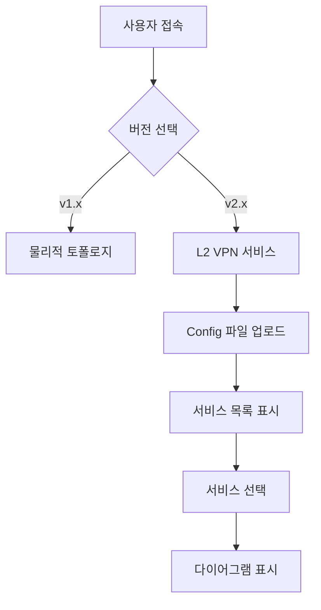

# 🎨 Nokia Config Visualizer v2.x UI/UX 목업

> MPLS L2 VPN 서비스 토폴로지 - 사용자 인터페이스 설계

## 📋 목차

- [화면 구성](#화면-구성)
- [사용자 흐름](#사용자-흐름)
- [컴포넌트 상세](#컴포넌트-상세)
- [인터랙션 패턴](#인터랙션-패턴)
- [반응형 디자인](#반응형-디자인)
- [접근성](#접근성)

---

## 🖥 화면 구성

### 전체 레이아웃

```
┌─────────────────────────────────────────────────────────────┐
│  Header                                                      │
│  ┌─────────────┐  ┌──────────────────────────────────────┐ │
│  │ Logo + Title│  │ [v1.x] [v2.x] Version Selector      │ │
│  └─────────────┘  └──────────────────────────────────────┘ │
├─────────────────────────────────────────────────────────────┤
│                                                              │
│  ┌──────────────────┐  ┌────────────────────────────────┐  │
│  │                  │  │                                │  │
│  │  Service List    │  │   Diagram Viewer               │  │
│  │  (Sidebar)       │  │                                │  │
│  │                  │  │   [Mermaid Diagram]            │  │
│  │  ┌────────────┐  │  │                                │  │
│  │  │ Epipe 100  │  │  │                                │  │
│  │  │ Epipe 200  │  │  │                                │  │
│  │  │ VPLS 300   │  │  │                                │  │
│  │  └────────────┘  │  │                                │  │
│  │                  │  │                                │  │
│  │  [Filters]       │  │   [Controls: Zoom, Export]     │  │
│  │                  │  │                                │  │
│  └──────────────────┘  └────────────────────────────────┘  │
│                                                              │
└─────────────────────────────────────────────────────────────┘
```

---

## 🔄 사용자 흐름

### 1. 초기 진입



### 2. 서비스 탐색 흐름

```
1. Config 업로드
   ↓
2. 서비스 자동 파싱
   ↓
3. 서비스 목록 표시 (Epipe, VPLS 구분)
   ↓
4. 필터 적용 (Customer, Service Type)
   ↓
5. 서비스 선택
   ↓
6. 다이어그램 생성 및 표시
   ↓
7. 상세 정보 확인
   ↓
8. 다이어그램 내보내기 (PNG/SVG)
```

---

## 🧩 컴포넌트 상세

### 1. Version Selector (버전 선택)

```tsx
// 위치: Header 우측

┌──────────────────────────────┐
│  [v1.x 물리적 연결]  [v2.x L2 VPN] │
│     (active)         (inactive)   │
└──────────────────────────────┘

// 상태
- Active: 파란색 배경, 흰색 텍스트
- Inactive: 회색 배경, 검은색 텍스트
- Hover: 밝은 파란색 배경
```

**기능:**
- v1.x ↔ v2.x 전환
- URL 라우팅 (`/` ↔ `/v2`)
- 상태 유지 (선택한 버전 기억)

---

### 2. Service List (서비스 목록)

```tsx
// 위치: 좌측 사이드바

┌─────────────────────────────┐
│  L2 VPN Services            │
├─────────────────────────────┤
│  🔍 Search: [________]      │
│                             │
│  📊 Filters:                │
│  ☐ Epipe                    │
│  ☐ VPLS                     │
│  Customer: [All ▼]          │
├─────────────────────────────┤
│  📁 Epipe Services (5)      │
│  ├─ ☑ Epipe 100             │
│  │   Customer 1             │
│  │   Site A ↔ Site B        │
│  ├─ ☐ Epipe 200             │
│  │   Customer 2             │
│  │   Office ↔ DC            │
│  └─ ☐ Epipe 300             │
│                             │
│  📁 VPLS Services (3)       │
│  ├─ ☐ VPLS 400              │
│  │   Customer 1             │
│  │   3 Sites                │
│  └─ ☐ VPLS 500              │
│      Customer 3             │
│      5 Sites                │
└─────────────────────────────┘
```

**기능:**
- 서비스 타입별 그룹화 (Epipe, VPLS)
- 검색 (Service ID, Description, Customer)
- 필터링 (Service Type, Customer)
- 다중 선택 (체크박스)
- 서비스 개수 표시
- 접기/펼치기

**서비스 카드 정보:**
- Service ID
- Service Type (아이콘)
- Customer ID
- Description
- SAP 개수 (VPLS의 경우)

---

### 3. Diagram Viewer (다이어그램 뷰어)

```tsx
// 위치: 메인 영역

┌────────────────────────────────────────┐
│  Epipe 100 - Customer A                │
│  ┌──────────────────────────────────┐  │
│  │  Controls:                       │  │
│  │  [🔍+] [🔍-] [⤢] [💾 PNG] [💾 SVG] │  │
│  └──────────────────────────────────┘  │
│                                        │
│  ┌──────────────────────────────────┐  │
│  │                                  │  │
│  │   [Mermaid Diagram]              │  │
│  │                                  │  │
│  │   SAP A ──→ Epipe 100 ──→ SAP B  │  │
│  │                                  │  │
│  └──────────────────────────────────┘  │
│                                        │
│  📋 Service Details:                   │
│  ├─ Service ID: 100                    │
│  ├─ Type: Epipe                        │
│  ├─ Customer: 1                        │
│  ├─ Description: "Site A to Site B"    │
│  └─ Admin State: Up                    │
│                                        │
│  📍 SAP Details:                       │
│  ├─ SAP 1: 1/1/1:100 (Site A)          │
│  │   ├─ Port: 1/1/1                    │
│  │   ├─ VLAN: 100                      │
│  │   └─ QoS: Ingress 10, Egress 20    │
│  └─ SAP 2: 1/1/2:100 (Site B)          │
│      ├─ Port: 1/1/2                    │
│      ├─ VLAN: 100                      │
│      └─ QoS: Ingress 10, Egress 20    │
└────────────────────────────────────────┘
```

**기능:**
- Mermaid 다이어그램 렌더링
- 확대/축소 (Zoom In/Out)
- 전체 화면 (Fullscreen)
- PNG/SVG 내보내기
- 서비스 상세 정보 표시
- SAP 상세 정보 표시

---

### 4. Epipe Diagram (Epipe 다이어그램)

```
┌─────────────────────────────────────────────────┐
│                                                 │
│   ┌──────────┐         ┌──────────┐            │
│   │  Site A  │         │ Epipe    │            │
│   │          │────────▶│  100     │            │
│   │ SAP:     │  Port:  │          │            │
│   │ 1/1/1:100│  1/1/1  │ Customer │            │
│   └──────────┘  VLAN:  │    1     │            │
│                  100    └──────────┘            │
│                              │                  │
│                              │ Port: 1/1/2      │
│                              │ VLAN: 100        │
│                              ▼                  │
│                         ┌──────────┐            │
│                         │  Site B  │            │
│                         │          │            │
│                         │ SAP:     │            │
│                         │ 1/1/2:100│            │
│                         └──────────┘            │
│                                                 │
└─────────────────────────────────────────────────┘
```

**스타일:**
- SAP: 사각형, 파란색 테두리
- Epipe: 마름모, 하늘색 배경
- 연결선: 실선, 화살표
- 라벨: 포트, VLAN 정보

---

### 5. VPLS Diagram (VPLS 다이어그램)

```
┌─────────────────────────────────────────────────┐
│                                                 │
│   ┌──────────┐                                  │
│   │  Site A  │                                  │
│   │ SAP:     │────┐                             │
│   │ 1/1/2:200│    │                             │
│   └──────────┘    │                             │
│                   │    ┌──────────┐             │
│   ┌──────────┐    │    │  VPLS    │             │
│   │  Site B  │    ├───▶│   200    │             │
│   │ SAP:     │    │    │          │             │
│   │ 1/1/3:200│────┤    │ Customer │             │
│   └──────────┘    │    │    1     │             │
│                   │    └──────────┘             │
│   ┌──────────┐    │         │                   │
│   │  Site C  │    │         │ SDP 10            │
│   │ SAP:     │────┘         ▼                   │
│   │ 1/1/4:200│         ┌──────────┐             │
│   └──────────┘         │ Remote PE│             │
│                        │ (SDP 10) │             │
│                        └──────────┘             │
│                                                 │
└─────────────────────────────────────────────────┘
```

**스타일:**
- SAP: 사각형, 파란색 테두리
- VPLS: 육각형, 주황색 배경
- 연결선: 실선 (SAP), 점선 (SDP)
- 중심 노드: VPLS 인스턴스

---

## 🎯 인터랙션 패턴

### 1. 서비스 선택

```
사용자 액션:
1. 서비스 목록에서 체크박스 클릭

시스템 반응:
1. 체크박스 상태 변경 (☐ → ☑)
2. 다이어그램 영역에 로딩 표시
3. 다이어그램 생성 (0.5초 이내)
4. 다이어그램 표시 + 애니메이션
5. 서비스 상세 정보 표시
```

### 2. 다중 서비스 선택

```
사용자 액션:
1. 여러 서비스 체크박스 선택

시스템 반응:
1. 선택된 서비스 개수 표시 (예: "3 services selected")
2. 통합 다이어그램 생성 옵션 표시
3. "Show Combined Diagram" 버튼 활성화
4. 버튼 클릭 시 통합 다이어그램 표시
```

### 3. 필터 적용

```
사용자 액션:
1. 필터 체크박스 변경 (예: Epipe만 표시)

시스템 반응:
1. 서비스 목록 즉시 필터링
2. 필터링된 개수 표시 (예: "Showing 5 of 8 services")
3. 애니메이션 효과 (fade in/out)
```

### 4. 검색

```
사용자 액션:
1. 검색창에 텍스트 입력 (예: "Customer 1")

시스템 반응:
1. 실시간 검색 (debounce 300ms)
2. 일치하는 서비스 하이라이트
3. 일치하지 않는 서비스 흐리게 표시
4. 검색 결과 개수 표시
```

---

## 📱 반응형 디자인

### 데스크톱 (1920px+)

```
┌──────────────────────────────────────────┐
│  Header                                  │
├─────────┬────────────────────────────────┤
│ Service │  Diagram Viewer                │
│  List   │                                │
│ (300px) │  (나머지 공간)                  │
│         │                                │
└─────────┴────────────────────────────────┘
```

### 태블릿 (768px - 1919px)

```
┌──────────────────────────────────────────┐
│  Header                                  │
├─────────┬────────────────────────────────┤
│ Service │  Diagram Viewer                │
│  List   │                                │
│ (250px) │  (나머지 공간)                  │
│         │                                │
└─────────┴────────────────────────────────┘
```

### 모바일 (< 768px)

```
┌──────────────────────────────┐
│  Header                      │
├──────────────────────────────┤
│  [☰] Service List (Drawer)   │
├──────────────────────────────┤
│                              │
│  Diagram Viewer              │
│  (전체 화면)                  │
│                              │
└──────────────────────────────┘

// 서비스 목록은 Drawer로 표시
// 햄버거 메뉴 클릭 시 좌측에서 슬라이드
```

---

## ♿ 접근성

### 키보드 네비게이션

```
Tab      : 다음 요소로 이동
Shift+Tab: 이전 요소로 이동
Enter    : 선택/활성화
Space    : 체크박스 토글
Esc      : 모달/드로어 닫기
Arrow Keys: 목록 내 이동
```

### 스크린 리더 지원

```tsx
// ARIA 레이블 예시
<div role="navigation" aria-label="Service list">
  <input 
    type="checkbox" 
    aria-label="Select Epipe service 100"
    aria-checked="true"
  />
</div>

<div role="main" aria-label="Service diagram">
  <svg aria-label="Epipe 100 topology diagram">
    <!-- Mermaid diagram -->
  </svg>
</div>
```

### 색상 대비

```
- 텍스트: #212121 (검은색)
- 배경: #FFFFFF (흰색)
- 대비율: 16:1 (WCAG AAA)

- 링크: #1976D2 (파란색)
- 배경: #FFFFFF (흰색)
- 대비율: 4.5:1 (WCAG AA)
```

---

## 🎨 색상 팔레트

### 서비스 타입별 색상

```
Epipe:
- 배경: #E1F5FF (하늘색)
- 테두리: #01579B (진한 파란색)
- 아이콘: 🔗

VPLS:
- 배경: #FFF3E0 (연한 주황색)
- 테두리: #E65100 (진한 주황색)
- 아이콘: 🌐

SAP:
- 배경: #E8F5E9 (연한 초록색)
- 테두리: #2E7D32 (진한 초록색)
- 아이콘: 📍

SDP:
- 배경: #F3E5F5 (연한 보라색)
- 테두리: #6A1B9A (진한 보라색)
- 아이콘: 🔀
```

### 상태별 색상

```
Active/Up:
- 색상: #4CAF50 (초록색)
- 아이콘: ✓

Down:
- 색상: #F44336 (빨간색)
- 아이콘: ✗

Warning:
- 색상: #FF9800 (주황색)
- 아이콘: ⚠

Info:
- 색상: #2196F3 (파란색)
- 아이콘: ℹ
```

---

## 📐 레이아웃 상수

```typescript
// src/constants/layout.ts

export const LAYOUT = {
  HEADER_HEIGHT: 64,
  SIDEBAR_WIDTH: {
    DESKTOP: 300,
    TABLET: 250,
    MOBILE: 0, // Drawer
  },
  DIAGRAM_MIN_HEIGHT: 400,
  DIAGRAM_MAX_HEIGHT: 800,
  
  BREAKPOINTS: {
    MOBILE: 768,
    TABLET: 1920,
  },
  
  SPACING: {
    XS: 4,
    SM: 8,
    MD: 16,
    LG: 24,
    XL: 32,
  },
};
```

---

## 🔤 타이포그래피

```css
/* 폰트 패밀리 */
--font-primary: 'Inter', -apple-system, BlinkMacSystemFont, 'Segoe UI', sans-serif;
--font-mono: 'Fira Code', 'Courier New', monospace;

/* 폰트 크기 */
--text-xs: 12px;
--text-sm: 14px;
--text-base: 16px;
--text-lg: 18px;
--text-xl: 20px;
--text-2xl: 24px;
--text-3xl: 30px;

/* 폰트 굵기 */
--font-normal: 400;
--font-medium: 500;
--font-semibold: 600;
--font-bold: 700;
```

---

## 🎬 애니메이션

```css
/* 페이드 인 */
@keyframes fadeIn {
  from { opacity: 0; }
  to { opacity: 1; }
}

/* 슬라이드 인 (좌측) */
@keyframes slideInLeft {
  from { transform: translateX(-100%); }
  to { transform: translateX(0); }
}

/* 스케일 업 */
@keyframes scaleUp {
  from { transform: scale(0.95); opacity: 0; }
  to { transform: scale(1); opacity: 1; }
}

/* 사용 예시 */
.service-card {
  animation: fadeIn 0.3s ease-in-out;
}

.diagram-viewer {
  animation: scaleUp 0.4s ease-out;
}
```

---

**작성일**: 2026-01-09  
**버전**: v2.0.0-ui-mockup  
**작성자**: Network Engineers
